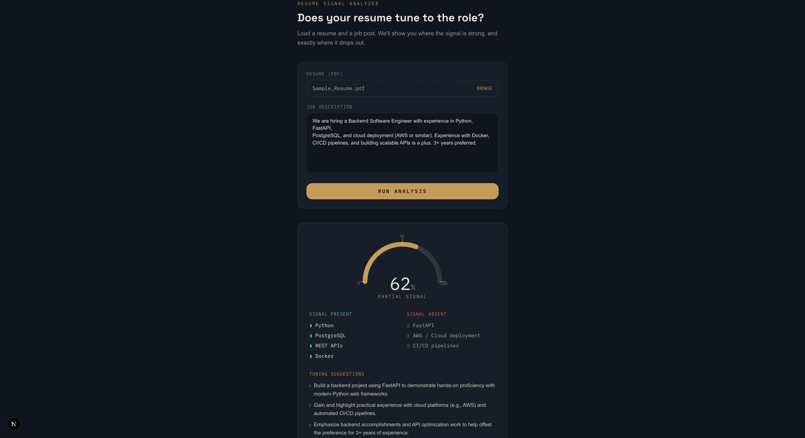

# AI Resume ↔ Job Signal Match


A full-stack tool that compares a resume against a job description and returns a match score, matched/missing skills, and concrete suggestions powered by an LLM with structured JSON output.

## Live Demo

**[ai-resume-signal-match.vercel.app](https://ai-resume-signal-match.vercel.app)**

> Note: the backend is hosted on a free tier and spins down after periods of inactivity. The first request may take up to a minute to respond while it wakes up, subsequent requests are fast.



## What it does

Upload a resume (PDF) and paste in a job description. The backend extracts the resume text, sends both to Gemini with a structured-output prompt, and returns:

- A **match score** (0-100), visualized as an animated gauge
- **Matched skills** - what's already on the resume that the role wants
- **Missing skills** - real gaps between the resume and the job
- **Suggestions** - specific, actionable advice to close the gap

## Tech stack

- **Backend:** FastAPI, pypdf, Google Gemini API (`gemini-3.6-flash`)
- **Frontend:** Next.js, TypeScript, Tailwind CSS
- **AI:** Structured JSON output via prompt engineering, with validation and fallback handling for malformed responses

## Handling malformed LLM output

LLMs occasionally return JSON wrapped in markdown code fences, or malformed JSON entirely — this can't be assumed away. The backend strips code fences before parsing and wraps `json.loads()` in a try/except. If parsing still fails, the API returns a clear `{"error": ...}` response with the raw model output attached, instead of crashing the request. This was tested directly by making the prompt intentionally ambiguous and observing failure cases before adding the fallback.

## Running it locally

### Backend

```bash
cd resume-matcher
python3 -m venv venv
source venv/bin/activate
pip install fastapi uvicorn pypdf google-genai python-multipart python-dotenv

# Create a .env file with your Gemini API key:
# GEMINI_API_KEY=your_key_here

uvicorn app:app --reload
```

Backend runs at `http://127.0.0.1:8000`. Interactive API docs at `http://127.0.0.1:8000/docs`.

### Frontend

```bash
cd frontend
npm install
npm run dev
```

Frontend runs at `http://localhost:3000`.

## Get a free Gemini API key

1. Go to [aistudio.google.com/apikey](https://aistudio.google.com/apikey)
2. Sign in with a Google account (no credit card required)
3. Click **Create API key** and copy it into your `.env` file

